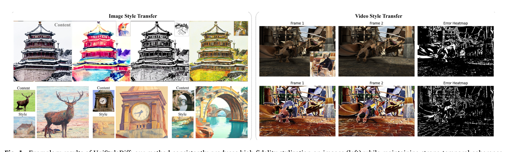
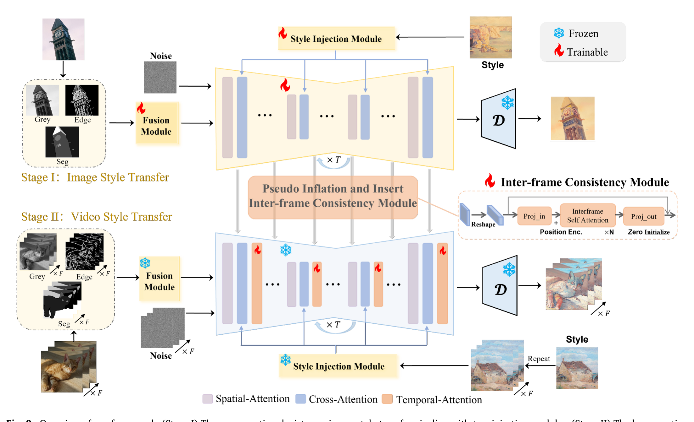

# UniStyleDiff：: A unified diffusion-driven framework for image and video style transfer
[Paper](https://www.sciencedirect.com/science/article/abs/pii/S0957417425043763) 

implementation of the paper:UniStyleDiff: A unified diffusion-driven framework for image and video style transfer (ESWA 2026).
<p align="center">
  
</p>

UniStyleDiff provides a two-stage pipeline that stylizes images first, then extends the model to videos with a pluggable inter-frame consistency module (ICM). Motion-Dynamics Preserved (MDP) sampling is used to guide temporal coherence at inference.

## Highlights

- Stage I image stylization with dual-branch adaptive feature injection.
- Stage II video extension with a trainable ICM and frozen image backbone.
- MDP sampling for temporal guidance during video generation.
- Text-free style transfer using CLIP image features as style tokens.

## Method Overview

Stage I (image):

Content image + Style image -> Content injection + Style tokens -> SD v1.5 UNet -> Stylized image

Stage II (video):

Video frames + Style image -> Frozen Stage I backbone + ICM -> Stylized video


## Repository Layout

- data: image and video datasets.
- models: content and style injection modules, ICM, attention processors.
- pipelines: image and video pipelines, MDP sampler.
- scripts: training and inference entry points.
- utils: config and seeding helpers.

## Install

This code depends on PyTorch, diffusers, transformers, torchvision, and Pillow.

Example:

```bash
pip install torch torchvision diffusers transformers pillow
```

## Datasets

Content images: place files under a folder such as `data/content/`.

Style images: place files under a folder such as `data/style/`.

Videos: each video should be a folder of frames under `data/videos/`.

## Quickstart

1. Create a JSON config.

Stage I example:

```json
{
  "seed": 42,
  "device": "cuda",
  "model": {"pretrained": "runwayml/stable-diffusion-v1-5"},
  "data": {
    "content_dir": "data/content",
    "style_dir": "data/style",
    "image_size": 512,
    "crop_size": 256
  },
  "style": {"num_tokens": 4, "token_dim": 768, "clip_model": "openai/clip-vit-large-patch14", "scale": 1.0},
  "content": {"grayscale_ratio": 0.05},
  "train": {"batch_size": 8, "lr": 1e-4, "epochs": 30, "num_workers": 8, "log_every": 50}
}
```

Stage II example:

```json
{
  "seed": 42,
  "device": "cuda",
  "model": {"pretrained": "runwayml/stable-diffusion-v1-5"},
  "data": {
    "video_dir": "data/videos",
    "style_dir": "data/style",
    "num_frames": 16,
    "frame_stride": 4,
    "image_size": 512
  },
  "icm": {"dim": 320, "heads": 8, "layers": 2, "targets": []},
  "mdp": {"guidance_scale": 1.0, "time_scale": 1.0},
  "style": {"num_tokens": 4, "token_dim": 768, "clip_model": "openai/clip-vit-large-patch14", "scale": 1.0},
  "content": {"grayscale_ratio": 0.05},
  "train": {"lr": 1e-5, "epochs": 50, "num_workers": 4, "log_every": 10}
}
```

2. Train Stage I.

```bash
python scripts/train_stage1.py --config /path/to/stage1.json
```

3. Train Stage II.

```bash
python scripts/train_stage2.py --config /path/to/stage2.json --stage1_ckpt /path/to/stage1.pt
```

## Architecture Details


  <td align="center" width="50%">
      
      <br />
     
</td>
 <td align="center" width="50%">
      
      <br />
     
 </td>


## Inference

Note: the provided inference scripts currently load the base SD v1.5 weights from `model.pretrained`. If you want to use Stage I or Stage II checkpoints, load them explicitly inside the scripts or extend the pipelines.

Image:

```bash
python scripts/infer_image.py \\
  --config /path/to/stage1.json \\
  --content /path/to/content.png \\
  --style /path/to/style.png \\
  --output /path/to/out.png
```

Video:

```bash
python scripts/infer_video.py \\
  --config /path/to/stage2.json \\
  --video_dir /path/to/frames_dir \\
  --style /path/to/style.png \\
  --output_dir /path/to/out_frames
```

## Website

A lightweight static homepage is available at `website/index.html`.

## Citation

```bibtex
@article{yang2025unistylediff,
  title={UniStyleDiff: A unified diffusion-driven framework for image and video style transfer},
  author={Yang, Siyu and Ke, Chunchen and Zhang, Jian and Miao, Chunwei and Liu, Xiyao and Wu, Songtao and Xu, Kuanhong and Huang, Da and Fang, Hui},
  journal={Expert Systems with Applications},
  pages={130761},
  year={2025},
  publisher={Elsevier}
}
```

## License

License is not specified yet.
